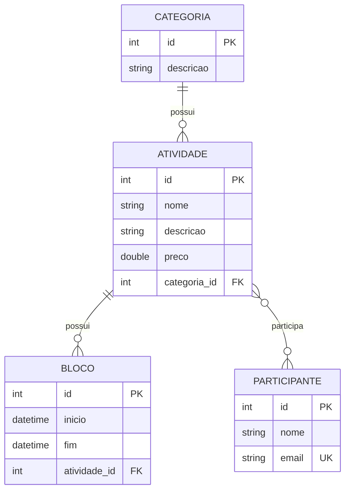

# Events System — Modelo de Domínio e ORM

Projeto desenvolvido para o **Desafio 02 — Modelo de Domínio e ORM**, da formação **Desenvolvedor Moderno — DevSuperior**.

A proposta do desafio é implementar, em **Spring Boot com Java e banco de dados H2**, o modelo conceitual de um sistema de gerenciamento de participantes e atividades de um evento acadêmico, incluindo o mapeamento objeto-relacional (ORM) e o carregamento inicial dos dados (seeding).

## Sobre o projeto

O **Events System** representa um evento acadêmico composto por atividades, como cursos, palestras e oficinas. Cada atividade possui informações básicas, pode estar associada a uma categoria, pode ocorrer em diferentes blocos de horário e pode possuir diversos participantes inscritos.

O projeto foi estruturado com **JPA/Hibernate** para transformar as entidades Java em tabelas relacionais no banco H2.

## Tecnologias utilizadas

- **Java 25**
- **Spring Boot 4.1.1**
- **Spring Data JPA**
- **Hibernate / Jakarta Persistence (JPA)**
- **H2 Database**
- **Maven Wrapper**
- **JUnit / Spring Boot Test**

## Modelo de domínio

O domínio possui quatro entidades principais:

- **Categoria** — representa a categoria de uma atividade.
- **Atividade** — representa uma atividade do evento, com nome, descrição e preço.
- **Bloco** — representa um período de realização de uma atividade, com início e fim.
- **Participante** — representa uma pessoa inscrita nas atividades, com nome e e-mail.

### Relacionamentos

- Uma **Categoria** possui várias **Atividades**.
- Uma **Atividade** pertence a uma **Categoria**.
- Uma **Atividade** possui vários **Blocos**.
- Cada **Bloco** pertence a uma **Atividade**.
- Uma **Atividade** pode possuir vários **Participantes**.
- Um **Participante** pode participar de várias **Atividades**.
- O relacionamento entre **Atividade** e **Participante** é implementado como **muitos-para-muitos**, por meio da tabela `tb_atividade_participante`.



## Mapeamento ORM

As classes do domínio utilizam anotações do Jakarta Persistence para definir o mapeamento entre objetos Java e tabelas do banco de dados.

| Classe | Tabela | Principais mapeamentos |
|---|---|---|
| `Categoria` | `tb_categoria` | `@Entity`, `@OneToMany` |
| `Atividade` | `tb_atividade` | `@Entity`, `@ManyToOne`, `@OneToMany`, `@ManyToMany` |
| `Bloco` | `tb_bloco` | `@Entity`, `@ManyToOne` |
| `Participante` | `tb_participante` | `@Entity`, `@ManyToMany`, e-mail único |

### Estratégia de relacionamento

O projeto utiliza:

- `@ManyToOne` para **Atividade → Categoria**;
- `@OneToMany(mappedBy = "atividade")` para **Atividade → Blocos**;
- `@ManyToMany` com `@JoinTable` para **Atividade ↔ Participante**;
- `@Column(unique = true)` no e-mail do participante, evitando duplicidade.

## Seeding do banco de dados

Os dados iniciais são carregados automaticamente pelo arquivo:

```text
src/main/resources/import.sql
```

O seeding cria:

- **2 categorias:** Curso e Oficina;
- **4 participantes:** José Silva, Tiago Faria, Maria do Rosário e Teresa Silva;
- **2 atividades:** Curso de HTML e Oficina de Github;
- **3 blocos de horário** distribuídos entre as atividades;
- **6 vínculos** entre atividades e participantes.

## Estrutura do projeto

```text
src/
├── main/
│   ├── java/com/devsuperior/eventssystem/
│   │   ├── EventssystemApplication.java
│   │   └── entidades/
│   │       ├── Atividade.java
│   │       ├── Bloco.java
│   │       ├── Categoria.java
│   │       └── Participante.java
│   └── resources/
│       ├── application.properties
│       ├── application-test.properties
│       └── import.sql
└── test/
    └── java/com/devsuperior/eventssystem/
        └── EventssystemApplicationTests.java
```

## Pré-requisitos

Antes de executar o projeto, certifique-se de ter instalado:

- **JDK 25**;
- **Git**, caso o projeto seja clonado;
- conexão com a internet na primeira execução, para que o Maven possa baixar as dependências.

## Como executar

### 1. Clonar o projeto

```bash
git clone <URL_DO_REPOSITORIO>
cd Projeto-EventsSystem-DevSuperior
```

### 2. Executar com Maven Wrapper

No Windows:

```bash
mvnw.cmd spring-boot:run
```

No Linux/macOS:

```bash
chmod +x mvnw
./mvnw spring-boot:run
```

A aplicação será iniciada, por padrão, em:

```text
http://localhost:8080
```

## Acessando o H2 Console

O projeto já está configurado para disponibilizar o console do H2.

Acesse:

```text
http://localhost:8080/h2-console
```

Use as seguintes configurações:

| Campo | Valor |
|---|---|
| JDBC URL | `jdbc:h2:mem:testdb` |
| User Name | `sa` |
| Password | *(vazio)* |

Após a conexão, as tabelas esperadas podem ser consultadas diretamente no banco.

## Principais tabelas

```text
tb_categoria
    └── tb_atividade
            ├── tb_bloco
            └── tb_atividade_participante ── tb_participante
```

## Configurações principais

O arquivo `application.properties` ativa o perfil `test` e desabilita o Open Session in View:

```properties
spring.application.name=eventssystem
spring.profiles.active=test
spring.jpa.open-in-view=false
```

As propriedades do perfil de teste configuram o H2 em memória, o console web, o dialeto Hibernate e o carregamento do `import.sql`.

## Testes

O projeto possui um teste de contexto com `@SpringBootTest`, responsável por verificar o carregamento da aplicação.

```bash
./mvnw test
```

No Windows:

```bash
mvnw.cmd test
```

## Objetivo acadêmico

Este projeto demonstra, de forma prática, os principais conceitos trabalhados no desafio:

- criação de entidades JPA;
- definição de chaves primárias e geração automática de IDs;
- relacionamentos `Many-to-One`, `One-to-Many` e `Many-to-Many`;
- criação de tabela associativa;
- restrição de unicidade no banco;
- persistência com Spring Data JPA/Hibernate;
- criação automática do esquema do banco;
- seeding inicial com `import.sql`;
- utilização do H2 Console para inspeção da estrutura e dos dados.

## Observação

O escopo deste projeto está concentrado no **modelo de domínio, ORM e persistência inicial**. O repositório não contém, neste estado, uma camada de controllers REST, serviços de negócio ou CRUD de API.

## Referência

Desafio: **Modelo de domínio e ORM — Formação Desenvolvedor Moderno (DevSuperior)**.

---

Projeto desenvolvido para fins acadêmicos e de estudo de **Spring Boot + JPA + ORM + H2**.
